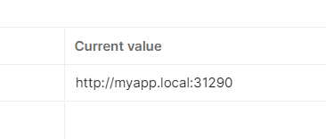

## Software Description

The software application I've designed is a simple e-commerce platform that consists of two main microservices: 

1. **Product Service**: Responsible for managing the product catalog, including adding, updating, deleting, and fetching product details.
2. **Order Service**: Handles customer orders, including placing an order, updating order status, and retrieving order details.

Both services communicate with a database microservice for data persistence.

## Software Architecture Design

### Components and Microservices:

#### 1. Product Service:
   - **Responsibility**: Manage the product catalog.
   - **Technology**: A RESTful API built using C# with ASP.NET Core.
   - **Database**: Connects to a PostgreSQL database to store product details.
   - **Kubernetes Deployment**: A Deployment with a Service exposing it internally.
   - **Horizontal Scaling**: Configured to allow multiple replicas.

#### 2. Order Service:
   - **Responsibility**: Handle customer orders.
   - **Technology**: A RESTful API built using C# with ASP.NET Core.
   - **Database**: Connects to a PostgreSQL database to store order details.
   - **Kubernetes Deployment**: A Deployment with a Service exposing it internally.
   - **Horizontal Scaling**: Configured to allow multiple replicas.

#### 3. PostgreSQL Database:
   - **Responsibility**: Persist data for products and orders.
   - **Technology**: PostgreSQL.
   - **Persistence**: Uses a Persistent Volume Claim (PVC) to ensure data is retained across restarts.
   - **Kubernetes Deployment**: A StatefulSet with a Service exposing it internally.

#### 4. Ingress Controller:
   - **Responsibility**: Expose the application to the outside world.
   - **Technology**: Nginx Ingress Controller.
   - **Configuration**: Routes external requests to the appropriate internal services.

### Architecture Principles:
- **Microservices Architecture**: Each functionality is broken down into a separate service.
- **Horizontal Scalability**: Each microservice can be scaled independently.
- **Statelessness**: The application services are stateless; state is maintained in the database.
- **Persistence**: Data is persisted using PostgreSQL with a PVC ensuring durability.

### Benefits and Challenges

#### Benefits:
- **Language Ecosystem**: C# and .NET provide a robust set of features, including strong typing, asynchronous programming, and a comprehensive standard library, which can lead to more maintainable and scalable services.
- **ORM Support**: Utilizing Entity Framework for Object-Relational Mapping (ORM) can help in simplifying database interactions and reducing boilerplate code.

#### Challenges:
- **Database Connections**: Each instance of the microservices will create new connections to the PostgreSQL database, which can lead to connection saturation. Connection pooling would need to be implemented effectively to mitigate this.
- **Transactional Consistency**: Ensuring transactional consistency across microservices can be challenging, especially in failure scenarios. Implementing a distributed transaction or Saga pattern could be considered to handle this.

### Security:
- **Data Encryption**: Ensure that sensitive data is encrypted both at rest and in transit. ASP.NET Core supports data protection APIs to encrypt sensitive data.
- **Authentication and Authorization**: Implement OAuth or OpenID Connect for secure API access, ensuring that only authorized users can access the services.
- **Network Security**: Utilize Kubernetes network policies to restrict communication between pods to only what is necessary.

### Mitigations:
- **Connection Pooling**: Utilize connection pooling in PostgreSQL to manage database connections efficiently.
- **Retry Mechanisms**: Implement retry mechanisms with exponential backoff to handle transient failures gracefully.
- **Secure Coding Practices**: Follow secure coding practices to prevent common vulnerabilities like SQL injection, cross-site scripting, etc.


1. Please find the code at this link
https://github.com/yasseralissa/BTH-HT23-PA2577-Assignment1

2. After clong the repo, please apply these:
```
   kubectl apply -f ./postgres/db-configmap.yaml
   kubectl apply -f ./postgres/db-persistent-volume.yaml
   kubectl apply -f ./postgres/db-volume-claim.yaml
   kubectl apply -f ./postgres/db-statefulSet.yaml
   kubectl apply -f ./postgres/db-deployment.yaml
   kubectl apply -f ./postgres/db-service.yaml

```

2. Deploying the product service, please apply these:
```
kubectl apply -f .\services\ProductService\deployment.yml
kubectl apply -f .\services\ProductService\service.yml

```

3. Deploying the order service, please apply these:
```
kubectl apply -f .\services\OrderService\deployment.yml
kubectl apply -f .\services\OrderService\service.yml

```
4. Deploy nginx-ingress
```
kubectl apply -f https://raw.githubusercontent.com/kubernetes/ingress-nginx/controller-v1.1.3/deploy/static/provider/baremetal/deploy.yaml

kubectl delete -A ValidatingWebhookConfiguration ingress-nginx-admission

kubectl apply -f ingress.yaml

```

5. find the port that nging is using
```
kubectl get svc -n ingress-nginx

```

6. Import postman collection PA2577.postman_collection.json

7. Update the variable clusterUrl with the right port



8. Execute the requests

